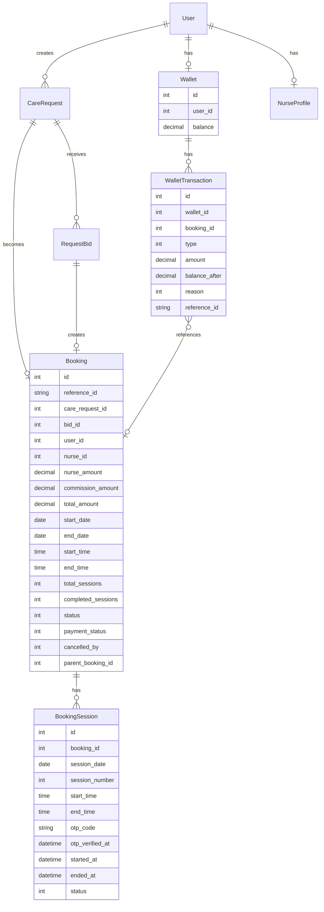

# VCanCares — System Architecture & Rules

> **Design Principles:** Simplicity · Predictability · No Over-engineering · 10+ Year Stability · Extensible

---

## Current System Flow (Confirmed)

```
User creates Request → System matches Nurses → Nurses place Bids → User selects Bid
→ Booking created (empty payment) → User pays → Wallet entry → Nurse notified → Service begins
```

---

## Q1: Nurse Bid — Per Request (Flat) ya Per Hour?

### Decision: **Puri Request pe Flat Bid**

| Option | Problem |
|--------|---------|
| Per Hour | Calculation complexity, disputes on hours, clock manipulation |
| **Per Request (Flat)** ✅ | Simple, predictable, no disputes |

**How it works:**
- Request me already `start_date`, `end_date`, `start_time`, `end_time` defined hai
- Nurse ko pura scope dikhta hai — "3 din, 9AM-5PM daily"
- Nurse ek **total flat amount** bid karti hai puri request ke liye
- `nurse_amount` = nurse ki total earning for the entire request
- Commission automatically calculated, `total_amount` = what user pays

**Why this is best:**
- No hour tracking disputes
- Nurse apni travel, effort sab factor karke bid deti hai
- User ko clear price dikhta hai — accept or reject
- Already your `RequestBid.nurse_amount` supports this perfectly

---

## Q2: OTP Verification — Roz ya Ek Baar?

### Decision: **Har Session (Day) pe OTP**

| Approach | Problem |
|----------|---------|
| One-time OTP | No proof nurse came daily, fraud risk |
| **Daily OTP** ✅ | Accountability, attendance proof, audit trail |

**How it works:**
- Har din jab nurse pahunchti hai → user se OTP leti hai
- OTP verify = session started for that day
- Nurse "End Session" karti hai jab kaam khatam
- This creates a daily attendance log automatically

**Implementation:** Simple `booking_sessions` table (covered in Q3)

---

## Q3: Multi-Day Booking → Sessions

### Decision: **Yes, Booking ko Daily Sessions me divide karo**

```
Booking (1 week, 9AM-5PM)
├── Session Day 1 — 20 May
├── Session Day 2 — 21 May
├── Session Day 3 — 22 May
├── Session Day 4 — 23 May
├── Session Day 5 — 24 May
├── Session Day 6 — 25 May
└── Session Day 7 — 26 May
```

**Table: `bookings`**
```
id, reference_id, care_request_id, bid_id, user_id, nurse_id,
nurse_amount, commission_amount, total_amount,
start_date, end_date, start_time, end_time,
total_sessions, completed_sessions,
status (0=pending_payment, 1=confirmed, 2=active, 3=completed, 4=cancelled),
cancelled_by, cancelled_at, cancellation_reason,
payment_status (0=unpaid, 1=paid, 2=refund_initiated, 3=refunded),
created_at, updated_at, soft_delete
```

**Table: `booking_sessions`**
```
id, booking_id, session_date, session_number,
start_time, end_time,
otp_code (6-digit, generated fresh daily),
otp_verified_at, started_at, ended_at,
status (0=upcoming, 1=started, 2=completed, 3=missed, 4=cancelled),
nurse_notes,
created_at, updated_at
```

**Session generation logic:**
- Jab booking confirm ho (payment done) → system auto-generates all sessions
- Each session = 1 row per day between `start_date` and `end_date`
- `per_session_amount` = `total_nurse_amount / total_sessions` (for pro-rata refund calculation)

---

## Q4: Nurse Cancels After Bid Selected (Before Service Starts)

### Scenario: Bid selected → Booking created → Nurse cancels

**Rules:**
1. If **before user payment** → Simple cancel, no penalty
   - Booking → `status = cancelled`, `cancelled_by = nurse`
   - Bid → `status = cancelled`
   - Request → reopen for bidding OR user can select another existing bid

2. If **after user payment** → Full refund to user wallet
   - Booking → `status = cancelled`, `cancelled_by = nurse`
   - Full `total_amount` refunded to user wallet
   - Nurse gets **penalty strike** (tracked in `nurse_profiles.total_bookings_cancelled`)
   - Request → user can re-open for new bids OR select another existing bid
   - 3 strikes → auto-suspend nurse

**Keep it simple:** No complex penalty fee from nurse initially. Just track cancellations and suspend repeat offenders.

---

## Q5: User Cancels After Payment (Before Service Starts)

### Cancellation Slab (configurable in `config/care.php`):

| When | Refund |
|------|--------|
| **24+ hours before start** | 100% refund |
| **12-24 hours before start** | 85% refund |
| **2-12 hours before start** | 50% refund |
| **< 2 hours before start** | 0% refund (No refund) |

**Implementation:**
```php
// config/care.php
'cancellation_slabs' => [
    ['hours_before' => 24, 'refund_percent' => 100],
    ['hours_before' => 12, 'refund_percent' => 85],
    ['hours_before' => 2,  'refund_percent' => 50],
    ['hours_before' => 0,  'refund_percent' => 0],
],
```

**What happens:**
- Calculate refund based on slab
- Refund amount → user wallet
- Non-refunded amount → platform keeps (covers nurse inconvenience)
- Booking → `status = cancelled`, `cancelled_by = user`
- Nurse notified immediately

---

## Q6: User Cancels 1-Month Booking After 2 Days

### Decision: **Pro-rata refund for remaining sessions**

**Formula:**
```
completed_sessions = 2
total_sessions = 30
per_session_rate = total_amount / total_sessions
remaining_sessions = total_sessions - completed_sessions  // 28

refund = remaining_sessions × per_session_rate × slab_refund_percent
```

**Slab applies to remaining portion only:**
- If cancelled 24+ hours before next session → 100% of remaining
- If cancelled < 24 hours → 85% of remaining
- etc.

**Nurse gets paid for completed sessions immediately** (2 days worth).

---

## Q7: Nurse Cancels 1-Month/1-Week Booking After 4 Days

### Decision: **User gets full refund for remaining sessions, Nurse paid for completed only**

**Rules:**
1. Nurse is paid for sessions **already completed** (4 days)
2. User gets **100% refund** for remaining sessions (no slab penalty — nurse's fault)
3. Nurse gets a cancellation strike
4. User can re-post the request for remaining period OR get full wallet refund

```
nurse_payment = completed_sessions × per_session_rate  (4 days)
user_refund = remaining_sessions × per_session_rate    (full, 26 days)
```

**No penalty deduction from user** when nurse cancels — this is critical for user trust.

---

## Q8: Nurse Daily Schedule / Multiple Bookings Per Day

### Decision: **Yes, Nurse can have multiple bookings. Show daily list.**

**Nurse App — "My Schedule" screen:**
```
Today — 20 May 2026
├── 08:00 - 12:00 → Patient: Rahul (Elder Care) — Session #3/7
├── 13:00 - 17:00 → Patient: Priya (Post-Op) — Session #1/3
└── 18:00 - 20:00 → Patient: Amit (Physio) — Session #5/10
```

**API endpoint:** `GET /api/nurse/schedule?date=2026-05-20`

**Query:**
```sql
SELECT bs.*, b.* FROM booking_sessions bs
JOIN bookings b ON b.id = bs.booking_id
WHERE b.nurse_id = ? AND bs.session_date = ? AND bs.status IN (0,1)
ORDER BY bs.start_time
```

**Conflict prevention:** When nurse places bid, system checks for time overlap with existing confirmed bookings. Nurse cannot bid on overlapping time slots.

---

## Q9: Booking Extension

### Decision: **New Request, New Bid cycle**

**Why not edit existing booking:**
- Nurse might not be available for extended period
- Price might differ
- Keeps system simple and auditable

**Flow:**
1. User taps "Extend" on active booking
2. System pre-fills a **new request** with same details, new dates starting from `end_date + 1`
3. Same nurse gets **priority notification** first (15-30 min head start)
4. Normal bidding cycle follows
5. If same nurse bids and is selected → new booking linked via `parent_booking_id`

**Simple addition to `bookings` table:**
```
parent_booking_id — nullable, FK to bookings.id
```

---

## Q10 (was Q8): Bidding Window Rules

### Decision: **Two rules based on lead time**

```
Lead Time = start_datetime - request_created_at
```

| Scenario | Bidding Window |
|----------|----------------|
| Lead time < 24 hours | Closes **2 hours before** `start_time` |
| Lead time ≥ 24 hours | Window stays open for **24 hours** from request creation |

**Implementation in `CareRequestService`:**
```php
public static function calculateBiddingEnd($startDate, $startTime, $createdAt): Carbon
{
    $sessionStart = Carbon::parse($startDate . ' ' . $startTime);
    $leadTimeHours = $createdAt->diffInHours($sessionStart);

    if ($leadTimeHours < 24) {
        // Urgent: close 2 hours before session
        return $sessionStart->subHours(2);
    }

    // Normal: 24-hour bidding window
    return $createdAt->addHours(24);
}
```

Already stored in `care_requests.bidding_ends_at` ✅

---

## Q11 (was Q9): Minimum Lead Time for Request

### Decision: **Minimum 3 hours from now**

```php
// config/care.php
'min_booking_notice_hours' => 3,  // (change from current 2 to 3)
```

**Breakdown:**
- ~1-2 hours for bidding window
- ~30 min for nurse to see, accept, travel
- ~30 min buffer

**Validation:**
```php
$earliestStart = now()->addHours(config('care.min_booking_notice_hours'));
if ($requestStartDatetime < $earliestStart) {
    throw new ValidationException('Session must start at least 3 hours from now');
}
```

---

## Q12 (was Q10): User Can Edit Request If No Match?

### Decision: **No edit. Cancel + Create New.**

**Why:**
- Editing a request that nurses already saw creates confusion
- Some nurses may have started preparing bids
- Audit trail becomes messy

**Flow:**
1. Request gets no bids → bidding window expires
2. Request auto-marked as `STATUS_FAILED_NO_BIDS` (already exists ✅)
3. User sees: "No nurses available. Create new request?"
4. User taps "Retry" → pre-filled new request form with old data
5. User adjusts time/date/care-type → submits fresh request

---

## Q13 (was Q11): When is Request Edit Allowed?

### Decision: **Request is IMMUTABLE after creation**

| State | Edit Allowed? |
|-------|---------------|
| Just created, matching in progress | ❌ No |
| Bids received | ❌ No |
| Bid selected, booking created | ❌ No |
| Any time | ❌ **Never** |

**Why immutable:**
- Nurses bid based on what they saw — changing it is unfair
- System matched nurses based on original criteria
- Creates audit nightmares
- 10+ year stability = no edge cases from partial edits

**Alternative:** User can **cancel** (free if no bids yet) and create new request.

**Cancellation is free when:**
- Status is `PENDING` or `MATCHING` and no bids received yet

---

## Q14 (was Q12): When is Bid Edit Allowed?

### Decision: **Bid can be edited/withdrawn ONLY while bidding window is open**

| State | Edit? | Withdraw? |
|-------|-------|-----------|
| Bidding window open, bid pending | ✅ Yes | ✅ Yes |
| Bidding window closed | ❌ No | ❌ No |
| Bid selected by user | ❌ No | ❌ No (use cancel flow) |

**Implementation:**
```php
public function canEditBid(RequestBid $bid): bool
{
    return $bid->status === RequestBid::STATUS_PENDING
        && $bid->careRequest->bidding_ends_at > now();
}
```

---

## Q15 (was Q13): Expired Window, No Bids, Time Passed

### Scenario: User posts at 8 AM for 12 PM → Bidding closes at 11 AM → No bids → Now 12 PM is gone

### Decision: **Request expires. User creates fresh request with future time.**

**Flow:**
1. 11:00 AM — `bidding_ends_at` reached, 0 bids
2. System marks request as `STATUS_FAILED_NO_BIDS`
3. Push notification: "No nurses found for your request"
4. User sees option: **"Book Again"**
5. App opens new request form pre-filled with old data BUT:
   - `start_date` defaults to **today or tomorrow**
   - `start_time` must be **≥ 3 hours from now**
   - System won't allow past times (standard validation)

**No magic.** User must pick a valid future time. The old expired request stays as-is for audit.

---

## Q16 (was Q14): Wallet System

### Decision: **Simple Ledger-based Wallet**

**Table: `wallets`**
```
id, user_id (unique), balance, created_at, updated_at
```

**Table: `wallet_transactions`**
```
id, wallet_id, booking_id (nullable),
type (1=credit, 2=debit),
amount, balance_after,
reason (integer constant),
description (text),
reference_id (uuid — for payment gateway tracking),
created_at
```

**Transaction Reasons (integer constants):**
```php
const REASON_BOOKING_PAYMENT = 1;      // User pays for booking
const REASON_CANCELLATION_REFUND = 2;  // Refund on cancellation
const REASON_NURSE_PAYOUT = 3;         // Nurse gets paid
const REASON_ADMIN_CREDIT = 4;         // Admin manually credits
const REASON_ADMIN_DEBIT = 5;          // Admin manually debits
const REASON_PLATFORM_FEE = 6;         // Commission earned
```

**Flow — User Pays for Booking:**
```
1. User selects bid → Booking created (status=pending_payment)
2. User pays via payment gateway
3. Payment success webhook →
   a. Debit user wallet (or direct payment recorded as credit+debit)
   b. wallet_transaction: type=debit, reason=BOOKING_PAYMENT
   c. Booking: payment_status=paid, status=confirmed
   d. Notify nurse: "Booking confirmed!"
   e. Generate all booking_sessions
```

**Flow — Cancellation Refund:**
```
1. Calculate refund amount (slab-based)
2. Credit user wallet
3. wallet_transaction: type=credit, reason=CANCELLATION_REFUND
4. Booking: payment_status=refund_initiated
```

**Flow — Nurse Payout (after session/booking completes):**
```
1. Session completed → mark session done
2. When ALL sessions complete → booking status=completed
3. Credit nurse wallet: nurse_amount
4. Platform keeps: commission_amount
```

---

## Complete Data Model Summary



---

## Config Additions (`config/care.php`)

```php
// Add these to existing config
'min_booking_notice_hours' => 3,

'cancellation_slabs' => [
    ['hours_before' => 24, 'refund_percent' => 100],
    ['hours_before' => 12, 'refund_percent' => 85],
    ['hours_before' => 2,  'refund_percent' => 50],
    ['hours_before' => 0,  'refund_percent' => 0],
],

'nurse_cancel_strike_limit' => 3,  // Auto-suspend after 3 cancellations

'extension_priority_window_minutes' => 30, // Same nurse gets priority for extensions
```

---

## Key Design Decisions Summary

| # | Decision | Rationale |
|---|----------|-----------|
| 1 | Flat bid per request | No hour-tracking disputes |
| 2 | Daily OTP | Attendance proof, accountability |
| 3 | Daily sessions | Pro-rata refunds, clear tracking |
| 4 | Nurse cancel = full user refund | User trust > everything |
| 5 | Slab-based user cancellation | Fair to both parties |
| 6 | Pro-rata for mid-booking cancel | Mathematically clean |
| 7 | Nurse paid for completed only | No advance payment risk |
| 8 | Nurse daily schedule view | Essential for multi-booking nurses |
| 9 | Extension = new request | Keeps system simple |
| 10 | Request is immutable | No edge cases, clean audit |
| 11 | Bid edit only during window | Predictable for everyone |
| 12 | Expired = new request | No time-travel hacks |
| 13 | Ledger-based wallet | Auditable, simple, proven pattern |

> [!IMPORTANT]
> Every financial operation (payment, refund, payout) MUST be wrapped in a database transaction.
> Every wallet credit/debit MUST record `balance_after` for audit reconciliation.
> Wallet balance should NEVER go negative — validate before every debit.
